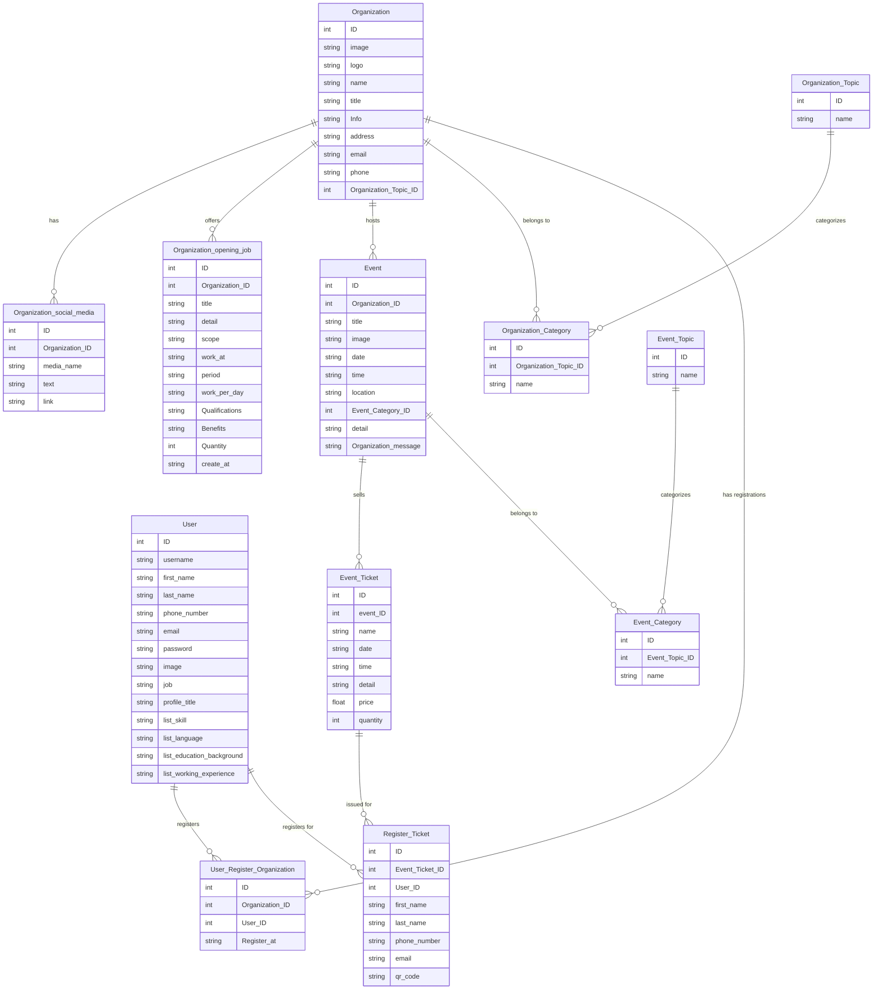

# Talent-Atmos-Backend

# Entity-Relationship Diagram

This ER diagram illustrates the relationships between various entities such as Organizations, Users, Events, and their related attributes.

``
Organization
- ID
- image
- logo
- name
- title
- Info **(have more detail)
- address
- email
- phone
- Organization Topic ID

Organization social media
- ID 
- Org ID
- media name => Website Facebook Instagram TikTok Youtube  
- text
- link

User Register Organization
- ID
- Org ID
- user ID
- Reg at

Organization opening job
- ID 
- Org ID
- title
- detail 
- scope
-  work at
- period
- work per day
- Qualifications 
- Benefits
- quantity
- create_at

User
-ID
- Username
- First Name
- last name
- phone number 
- email
- password
- image
- Job
- profile title
- list skill
- list language
-  list Education Background
-  list Working Experience

Organization Topic
- ID
- name

Event Topic
- ID
- name

Organization Category
- ID
- Organization Topic ID
- name

Event Category
- ID
- Event Topic ID
- name

Event
- ID
- Organization ID
- title
- image
- Date ** 
- time ** 
- location
- Event Category ID 
- detail
- Organization message

Event Ticket
- ID 
- event ID
- name
- Date ** 
- time ** 
- detail
- price
- quantity

Register Ticket
- ID
- Event Ticket ID
- User ID
- First Name
- last name
- phone number 
- email
- QR code
``

